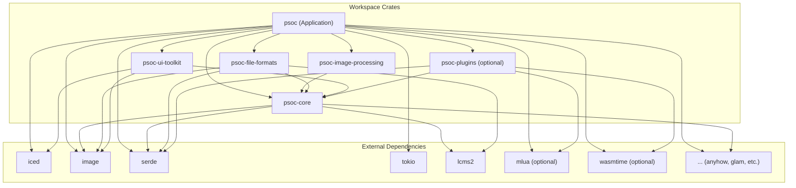

# Project PSOC - Comprehensive Analysis Report

## 1. 项目概述 (Project Overview)

**项目名称 (Project Name):** PSOC

**主要功能和目的 (Main Function and Purpose):**
PSOC (可能意指 Photoshop Open Source Clone 或类似概念) 是一个雄心勃勃的开源项目，旨在使用Rust编程语言从头开始构建一款功能丰富、高性能的桌面图像编辑应用程序。该项目深受Photoshop、GIMP和Krita等成熟图像编辑软件的启发，致力于提供强大的图像处理能力、现代化的用户界面和优秀的用户体验。其核心目标包括实现卓越的性能、利用Rust的内存安全特性减少错误和漏洞、支持跨平台运行，并构建一个模块化、可扩展的系统。

**使用的编程语言与技术栈 (Programming Language & Technology Stack):**
*   **核心语言 (Core Language):** Rust (版本 2021 edition)
*   **GUI框架 (GUI Framework):** `iced` (一个现代化的Rust GUI库)
    *   **渲染后端 (Rendering Backend):** `wgpu` (通过 `iced` 实现)，结合 `tiny-skia` 进行2D图形渲染。
*   **图像处理 (Image Processing):** 主要使用 `image` crate进行图像编解码和基本操作，`ndarray` 可能用于复杂的数组运算，`rayon` 用于并行处理以提升性能。
*   **颜色管理 (Color Management):** 项目包含自定义的颜色管理逻辑 (支持RGB, HSL, HSV色彩空间)，并已集成ICC配置文件支持。
*   **异步处理 (Async Runtime):** `tokio` 用于管理异步任务。
*   **序列化 (Serialization):** `serde` (配合 `serde_json` 和 `ron`) 用于数据序列化和反序列化，其中 `ron` 可能用于自定义的项目文件格式。
*   **构建系统 (Build System):** Cargo (Rust的官方构建工具和包管理器)。
*   **错误处理 (Error Handling):** `anyhow` 和 `thiserror`。
*   **数学库 (Math Library):** `glam` 用于向量和矩阵运算。

**许可证类型 (License Type):**
项目采用双重许可 (Dual-licensed):
*   **MIT License**
*   **Apache License 2.0**
这意味着用户和贡献者可以根据自己的需求选择任一许可证。

**项目活跃度评估 (Project Activity Assessment):**
根据项目文档和结构判断，PSOC项目表现出较高的活跃度：
*   **开发阶段 (Development Stage):** 项目目前处于 "Alpha 开发阶段"，但已完成大量预定功能。`Cargo.toml` 中项目版本为 `0.7.0`。
*   **功能完整性 (Feature Completeness):** `README.md` 文档详细列出了大量已完成的里程碑 (直至P7.3)，包括核心引擎、完整的图层系统 (含调整图层、智能对象、图层蒙版、16种混合模式)、10种专业工具、非破坏性编辑工作流、高级UI功能 (如历史记录面板、颜色选择器、标尺网格)、图像调整与滤镜、撤销/重做系统以及初步的颜色管理和快捷键支持。
*   **代码量与测试 (Codebase & Testing):** 提及拥有206个单元测试，并通过了零编译错误和警告的内部标准。
*   **模块化 (Modularity):** 项目结构清晰，分为多个内部 `crates` (如 `psoc-core`, `psoc-image-processing`, `psoc-file-formats`, `psoc-ui-toolkit`, `psoc-plugins`)，表明良好的模块化设计。
*   **文档 (Documentation):** 存在 `CHANGELOG.md` 和详细的 `README.md`，以及 `docs/` 目录下的其他开发文档。

总体而言，PSOC项目虽然仍在Alpha阶段，但其进展迅速，功能规划宏大且已实现核心部分，显示出开发团队的积极投入和清晰的开发路线图。

## 2. 代码结构分析 (Code Structure Analysis)

PSOC项目采用了清晰的多层级模块化结构，主要围绕Rust的Cargo工作空间 (workspace) 和内部模块进行组织。

**主要目录结构及其用途 (Main Directory Structure & Purpose):**

*   **`src/`**: 主应用程序目录。
    *   **`main.rs`**: 应用程序的入口点。负责初始化环境 (如日志)，配置并启动`Application`实例 (来自`src/lib.rs`)。通过feature flag (`gui`) 支持带GUI或纯命令行的启动模式。
    *   **`lib.rs`**: 主库crate，定义了应用的核心模块和公共API。它聚合了来自工作空间中其他crates的功能，并组织了应用层面的逻辑。
    *   **`app/`**: 包含应用的主控制逻辑, 如 `Application` 结构体和配置。
    *   **`commands/`**: 实现具体的命令对象，用于执行操作并支持撤销/重做。
    *   **`core/`**: 可能是对 `psoc-core` crate中核心数据结构的进一步封装或应用层面的扩展。
    *   **`file_io/`**: 处理文件输入输出的顶层抽象，协调`psoc-file-formats` crate的功能。
    *   **`image_processing/`**: 应用层面的图像处理接口，可能调用`psoc-image-processing`中的算法。
    *   **`rendering/`**: 管理画布和图像的渲染流程。
    *   **`shortcuts/`**: 键盘快捷键管理系统。
    *   **`tools/`**: 工具系统，包括工具管理、工具抽象接口和具体工具的实现。
    *   **`ui/` (`#[cfg(feature = "gui")]`)**: 用户界面相关代码，使用 `iced` GUI框架。包含应用状态管理 (`AppState`)、UI消息处理 (`Message`)、自定义组件 (如`ImageCanvas`) 和对话框。
    *   **`utils/`**: 通用工具模块，如错误处理 (`PsocError`) 和日志配置。
    *   **`plugins/` (`#[cfg(feature = "plugins")]`)**: 插件系统集成。

*   **`crates/`**: Cargo工作空间，包含多个独立的库crates，每个crate负责一部分核心功能：
    *   **`psoc-core/`**: 项目的核心基础库。定义了所有基本数据结构和核心算法，如文档 (`Document`)、图层 (`Layer`, `LayerType`, `SmartObjectLayer`)、选区 (`Selection`)、颜色 (`Color`, `HslColor`, `HsvColor`, `ColorSpace`)、图像调整 (`AdjustmentEntry`)、几何图形 (`Rect`, `Point`)、混合模式 (`BlendMode`)、命令模式 (`Command`, `CommandStack`)以及颜色管理 (`ColorManager`, `IccProfile`)。这是整个项目数据模型和核心操作逻辑的基石。
    *   **`psoc-image-processing/`**: 专注于提供图像处理算法和滤镜。其`lib.rs`目前内容较少，表明具体实现可能在其他地方或待填充。
    *   **`psoc-file-formats/`**: 负责所有文件格式的解析和保存。内置PNG、JPEG的加载/保存逻辑 (包括ICC Profile处理)，以及自定义的`.psoc`项目文件格式的处理。提供了`ImageIO`和`FileIO`两个高级API进行操作。
    *   **`psoc-ui-toolkit/`**: 目标是提供一套自定义的UI组件、布局和主题，以扩展或补充`iced`框架。目前其`lib.rs`中的模块 (`layouts`, `themes`, `widgets`) 尚为占位符。
    *   **`psoc-plugins/`**: 实现插件系统架构。包含插件API定义 (`api`)、插件管理器 (`manager`)，并通过feature flags支持Lua (`lua`) 和WASM (`wasm`) 插件。

*   **`docs/`**: 存放项目文档。
*   **`examples/`**: 包含如何使用库crate的示例代码。
*   **`tests/`**: 包含集成测试。单元测试通常与源代码文件或模块放在一起。
*   **`benches/`**: 包含性能基准测试。
*   **`Cargo.toml`**: (根目录) 定义了整个工作空间、主应用包的元数据、依赖项和feature flags。
*   **`.github/`**: 包含GitHub Actions工作流 (CI/CD) 和Issue模板。

**关键源代码文件及其作用 (Key Source Code Files & Their Roles):**

*   **`src/main.rs`**: 启动和基本配置。
*   **`src/lib.rs`**: 应用层模块组织和API导出。
*   **`src/app/application.rs` (推测)**: `Application` 结构体定义，管理应用生命周期和状态。
*   **`src/ui/application.rs` (推测, 对应 `PsocApp` in `src/lib.rs`)**: `iced` GUI应用的入口和消息循环。
*   **`crates/psoc-core/src/document.rs`**: `Document` 结构体定义，是编辑工作的核心数据模型。
*   **`crates/psoc-core/src/layer.rs`**: `Layer` 枚举和相关结构体定义，图层系统的核心。
*   **`crates/psoc-core/src/command.rs`**: `Command` trait和`CommandStack`，实现撤销/重做。
*   **`crates/psoc-file-formats/src/lib.rs`**: `ImageIO` 和 `FileIO` 结构体，统一文件操作入口。
*   **`crates/psoc-plugins/src/manager.rs`**: 插件加载和管理的逻辑。

**代码组织模式 (Design Patterns, Architectural Patterns, etc.):**

*   **模块化设计 (Modular Design):** 通过Cargo工作空间和内部模块实现了高度的模块化。
*   **库优先方法 (Library-first Approach):** 核心功能在库crate中实现，`main.rs`仅作为启动器。
*   **关注点分离 (Separation of Concerns):** 数据核心 (`psoc-core`)、文件处理 (`psoc-file-formats`)、UI (`src/ui`)、插件 (`psoc-plugins`) 等功能清晰分离。
*   **Feature Flags:** 用于条件编译，实现不同构建版本和可选功能，增强了灵活性和模块化。
*   **命令模式 (Command Pattern):** 在 `psoc-core/src/command.rs` 中明确实现，用于可撤销的操作。
*   **外观模式 (Facade Pattern):** `psoc-file-formats/src/lib.rs` 中的 `FileIO` 和 `ImageIO` 为文件操作提供了简化接口。`src/lib.rs` 本身也扮演了应用层API的外观角色。
*   **Model-View-Controller (MVC) / Model-View-Update (MVU) (针对GUI):**
    *   **Model:** 主要由 `psoc-core` 中的数据结构 (如 `Document`, `Layer`) 和 `src/app/AppState.rs` (推测) 中的应用状态构成。
    *   **View:** `src/ui/` 目录下的代码，使用 `iced` 框架渲染用户界面。
    *   **Controller/Update:** `iced` 应用中的 `update` 函数 (在 `src/ui/application.rs` 或类似文件中) 根据用户输入 (`Message`) 更新Model，并间接触发View的重新渲染。命令对象 (`src/commands/`) 也扮演控制器角色，修改Model。
*   **依赖注入 (Dependency Injection) (轻量级):** `Application` 通过 `AppConfig` 接收配置，这是一种形式的依赖注入。

**代码模块化程度评估 (Code Modularity Assessment):**
**高 (High)**。
项目展示了出色的模块化程度：
1.  **清晰的边界:** 工作空间中的每个crate都有明确定义的职责和独立的API。
2.  **低耦合:** 各个主要功能区 (核心逻辑、文件IO、UI、插件) 被分离到不同的crates中，减少了它们之间的直接依赖。`psoc-core` 作为基础被其他模块依赖，但它本身不依赖UI或插件等高层模块。
3.  **高内聚:** 每个crate内部的模块也围绕特定功能组织，例如 `psoc-core` 内部分为 `document`, `layer`, `color` 等。
4.  **可替换性与可扩展性:** 插件系统 (`psoc-plugins`) 的设计本身就是为了提高可扩展性。UI部分如果未来需要更换GUI框架，由于其相对独立，理论上也会更容易。
5.  **可测试性:** 模块化的设计使得单元测试和集成测试更容易编写和管理。

这种高度模块化的结构有利于代码的维护、团队协作、功能扩展和长期演进。

## 3. 功能地图 (Functional Map)

PSOC旨在成为一款功能全面的图像编辑器，其功能可以从项目文档和代码结构中梳理出来。

**核心功能列表及描述 (Core Function List & Description):**

1.  **项目与文件管理 (Project & File Management):**
    *   **功能:** 创建新文档、打开现有项目 (`.psoc`格式) 及常见图像格式 (PNG, JPEG)、保存为项目文件、导出为扁平化图像 (PNG, JPEG)。
    *   **实现:** 主要由 `psoc-file-formats` crate (处理文件解析与序列化) 和 `src/file_io/` 模块 (应用层API) 提供支持。

2.  **文档与画布系统 (Document & Canvas System):**
    *   **功能:** 管理图像的核心数据结构 (`Document`)，提供2D渲染画布用于图像显示和用户交互。
    *   **实现:** `psoc-core/src/document.rs` 定义文档结构，`src/ui/` (通过`iced`) 管理画布显示，`psoc-core/src/rendering.rs` 负责渲染逻辑。

3.  **图层系统 (Layer System):**
    *   **功能:** 支持非破坏性编辑流程。包括多种图层类型 (像素图层, 调整图层, 智能对象图层)，图层操作 (创建, 删除, 复制, 显隐, 不透明度, 顺序调整)，16种专业图层混合模式，以及图层蒙版。
    *   **实现:** `psoc-core/src/layer.rs` 定义图层结构和属性，`psoc-core/src/document.rs` 管理图层栈，渲染引擎 (`psoc-core/src/rendering.rs`) 负责图层合成。

4.  **选区功能 (Selection System):**
    *   **功能:** 创建和管理选区 (如矩形、椭圆、套索、魔棒工具)，选区用于限定编辑操作的范围。
    *   **实现:** `psoc-core/src/selection.rs` 定义选区数据，`src/tools/` 包含选区工具实现，`src/commands/selection_commands.rs` 处理选区相关的命令。

5.  **绘图与编辑工具 (Drawing & Editing Tools):**
    *   **功能:** 提供多种工具进行图像创作和修改，如画笔、橡皮擦、渐变、形状、文本、移动、变换、裁剪、吸管等。
    *   **实现:** `src/tools/` 目录下包含各工具的具体逻辑和UI交互，`src/commands/` 下有对应的命令 (如 `paint_commands.rs`, `transform_commands.rs`) 将工具操作转化为可记录的编辑步骤。

6.  **图像调整与滤镜 (Image Adjustments & Filters):**
    *   **功能:** 提供丰富的图像调整选项 (亮度/对比度, 色相/饱和度, 色阶, 曲线等) 和效果滤镜 (高斯模糊, 锐化等)。支持通过调整图层进行非破坏性调整。
    *   **实现:** `psoc-core/src/adjustment.rs` 和 `psoc-core/src/adjustments/` 定义调整类型和参数，`psoc-image-processing` (理论上) 提供算法实现，`src/commands/adjustment_commands.rs` 封装调整操作。

7.  **颜色管理 (Color Management):**
    *   **功能:** 处理不同的色彩空间 (RGB, HSL, HSV)，支持ICC配置文件以保证颜色的一致性。
    *   **实现:** `psoc-core/src/color.rs` (色彩模型) 和 `psoc-core/src/icc.rs` (ICC配置文件和转换逻辑)。

8.  **用户界面系统 (User Interface System):**
    *   **功能:** 提供图形用户界面，包括主窗口、菜单、工具栏、多个面板 (图层、工具选项、颜色、历史记录、状态信息) 和对话框。支持标尺、网格和参考线。
    *   **实现:** `src/ui/` 目录使用 `iced` GUI框架构建界面，`psoc-ui-toolkit` crate 计划提供自定义UI组件。

9.  **历史记录与撤销/重做 (History & Undo/Redo System):**
    *   **功能:** 跟踪用户执行的每一个可编辑操作，允许用户撤销和重做这些操作，并通过历史记录面板进行导航。
    *   **实现:** 基于 `psoc-core/src/command.rs` 中定义的命令模式 (`Command`, `CommandStack`)。

10. **插件系统 (Plugin System - Optional):**
    *   **功能:** 允许通过外部脚本 (Lua) 或模块 (WASM) 扩展应用功能。
    *   **实现:** `psoc-plugins` crate (包含 `api`, `manager`, `lua`, `wasm` 模块)。

11. **快捷键系统 (Shortcut System):**
    *   **功能:** 为常用操作和工具提供键盘快捷键支持。
    *   **实现:** `src/shortcuts/` 模块。

**功能之间的关系和交互方式 (Functional Interactions):**

典型的编辑工作流展示了各功能模块间的交互：

1.  **启动与加载:** `main.rs` 启动 `Application` (`src/app/`)，初始化UI (`src/ui/`)。用户通过UI打开文件，触发 `src/file_io/` (调用 `psoc-file-formats`) 加载图像数据到 `Document` (`psoc-core/src/document.rs`)。画布 (`src/ui/canvas.rs` 或 `iced`集成) 渲染文档内容。
2.  **工具使用:** 用户从UI选择一个工具 (如画笔，由 `src/tools/tool_manager.rs` 管理)。工具的交互逻辑在对应的工具模块 (`src/tools/tools.rs`) 中处理。当用户在画布上操作时，工具将用户输入转换为一个具体的 `Command` 对象 (来自 `src/commands/`)。
3.  **命令执行:** 该 `Command` 对象被执行，直接修改 `Document` 中的数据 (如图层像素 `psoc-core/src/pixel.rs`，或选区 `psoc-core/src/selection.rs`)。执行后的命令被推入 `CommandStack` (`psoc-core/src/command.rs`)。
4.  **渲染更新:** `Document` 的变更会通知UI，触发渲染管线 (`psoc-core/src/rendering.rs` 和 `src/rendering/`) 更新画布显示。图层面板、历史记录面板等UI元素也会相应更新。
5.  **调整与效果:** 用户添加调整图层或滤镜时，会创建一个新的 `AdjustmentLayer` (`psoc-core/src/layer.rs`) 或应用一个算法 (来自 `psoc-image-processing`)。这些操作同样通过 `Command` 模式记录。渲染引擎在最终合成图像时会考虑这些调整。
6.  **保存:** 用户保存时，`src/file_io/` 将当前的 `Document` 对象通过 `psoc-file-formats` 序列化到磁盘。

**用户流程图 (User Flow Example - Applying a Blur Filter Non-Destructively):**

*   用户 -> 打开图像 (File I/O -> Document created -> Canvas displays image)
*   用户 -> 右键点击图层面板中的目标图层 -> 选择“转换为智能对象”
    *   *内部: `ConvertToSmartObjectCommand` -> Layer type changes, content preserved.*
*   用户 -> 选中智能对象图层 -> 菜单栏选择 "滤镜" -> "模糊" -> "高斯模糊"
    *   *内部: UI triggers filter selection -> `ApplyFilterToSmartObjectCommand` (or similar) is prepared.*
*   用户 -> 在高斯模糊对话框中调整模糊半径 -> 点击 "确定"
    *   *内部: Command stores filter type and parameters -> Command executed -> Smart Object's filter list updated -> Document state changes.*
*   画布 -> 实时预览或最终显示应用了高斯模糊效果的图层。模糊效果作为智能滤镜依附于智能对象，不直接修改原始像素。
*   用户 -> 可在图层面板中显隐或再次编辑该智能滤镜。

*(注: 由于无法生成真实图表，此处以文本描述用户流程。API接口分析也基于代码结构推断，主要指模块间的内部API而非公开的网络API。)*

## 4. 依赖关系分析 (Dependency Analysis)

PSOC项目利用了Rust生态系统中众多优秀的外部crates，并通过Cargo工作空间管理内部模块间的依赖。

**外部依赖库列表及其用途 (External Dependency List & Purpose):**

此处列出主要应用 (`psoc` crate) 和各工作空间成员crate所依赖的关键外部库：

*   **主应用 (`psoc`):**
    *   `anyhow` (v1.0.98), `thiserror` (v2.0.12): 灵活的错误处理机制。
    *   `tracing` (v0.1.41), `tracing-subscriber` (v0.3.19): 日志与追踪框架。
    *   `serde` (v1.0.219), `serde_json` (v1.0.140): 通用数据序列化/反序列化 (JSON支持)。
    *   `iced` (v0.13.1, `gui` feature): 核心GUI框架，启用特性如 `canvas`, `image`, `svg`, `tokio`, `advanced`。
    *   `rfd` (v0.15.3, `gui` feature): 提供原生文件对话框。
    *   `image` (v0.25.6): 图像编解码及基本处理，支持PNG, JPEG, TIFF, WebP。
    *   `ab_glyph` (v0.2.29): 字体光栅化和文本布局。
    *   `glam` (v0.30.3): 用于图形的向量和矩阵数学运算。
    *   `tokio` (v1.45.1): 异步运行时。
    *   `mlua` (v0.10.5, `plugins` feature with `lua` sub-feature): Lua脚本引擎集成。
    *   `wasmtime` (v33.0.0, `plugins` feature with `wasm` sub-feature): WebAssembly运行时集成。
    *   `uuid` (v1.17.0): 生成唯一标识符。

*   **`psoc-core` (核心库):**
    *   `ndarray` (v0.16): N维数组运算。
    *   `nalgebra` (v0.33): 线性代数库。
    *   `lcms2` (v6.1.0): Little CMS 2，用于专业的颜色管理。
    *   `chrono` (v0.4.41): 日期和时间处理。
    *   `rayon` (v1.10.0): 数据并行处理。
    *   (还依赖 `serde`, `glam`, `image`, `anyhow`, `thiserror`, `uuid`, `tracing`，版本与主应用类似)

*   **`psoc-file-formats` (文件格式库):**
    *   `flate2` (v1.0): DEFLATE压缩/解压缩 (如用于PNG内部或压缩的ICC Profile)。
    *   `ron` (v0.10.1): Rusty Object Notation，用于项目文件的序列化。
    *   (还依赖 `image`, `lcms2`, `anyhow`, `thiserror`, `tracing`, `serde`, `chrono`，版本与主应用或core库类似)

*   **`psoc-ui-toolkit` (UI组件库):**
    *   (主要依赖 `iced`, `image`, `glam`, `serde`, `anyhow`, `thiserror`, `tracing`，版本与主应用类似)

*   **`psoc-plugins` (插件系统库):**
    *   (主要依赖 `serde`, `anyhow`, `thiserror`, 以及可选的 `mlua` 和 `wasmtime`)

**内部模块间依赖关系图 (Internal Module Dependency Graph):**

PSOC采用Cargo工作空间 (workspace) 来组织其内部crates，它们之间的依赖关系如下（箭头表示“依赖于”）：

*   **核心地位:** `psoc-core` 是最基础的crate，不依赖工作空间内任何其他crate。其他所有内部crates都直接或间接依赖于`psoc-core`。
*   **应用层聚合:** 主应用crate `psoc` 聚合了所有其他工作空间成员的功能。

**依赖更新频率和维护状态 (Dependency Update Frequency & Maintenance Status):**

*   **评估:** 无法直接在本环境中实时检查各依赖的最新版本和更新频率。
*   **普遍情况:** 项目所选用的依赖 (如 `iced`, `image`, `serde`, `tokio`, `rayon`, `glam`, `lcms2`) 大多是Rust生态中流行且积极维护的库。这意味着它们通常有较好的更新频率，能及时修复bug和安全问题，并跟进Rust语言的发展。
*   **建议:** 项目应定期使用工具如 `cargo outdated` 检查并更新依赖，以获取最新修复和功能，同时注意潜在的破坏性更新。

**潜在的依赖风险评估 (Potential Dependency Risk Assessment):**

1.  **依赖膨胀与编译时间 (Dependency Bloat & Compile Times):** GUI库 (`iced`) 和其他一些大型库可能会引入庞大的传递性依赖，增加总体编译时间和二进制文件大小。
2.  **API不兼容更新 (Breaking Changes):** 主要依赖 (特别是 `iced`, `tokio`, `image`) 的大版本更新可能带来API不兼容，需要项目代码进行适配。
3.  **安全性 (Security):**
    *   任何外部依赖都可能成为安全漏洞的来源，特别是处理文件解析 (`image`, `ron`, `serde_json`)、颜色管理 (`lcms2`) 或执行外部代码 (`mlua`, `wasmtime`) 的库。
    *   需要定期使用 `cargo audit` 或类似工具扫描已知的安全漏洞。
4.  **维护停滞 (Stagnation):** 若某个关键依赖不再积极维护，可能会成为项目的瓶颈或安全隐患。目前来看，所选依赖风险较低，但仍需关注。
5.  **特性标志复杂性 (Feature Flag Complexity):** 项目自身及依赖库中广泛使用feature flags (如 `iced` 的 `tokio` 集成, `psoc-plugins` 的 `lua`/`wasm` 支持)。需要确保这些feature flags在不同库之间正确组合和兼容。
6.  **生态系统成熟度:** 虽然Rust生态发展迅速，但某些特定领域的库可能不如C/C++生态中同类库历史悠久或功能全面，可能需要项目方自行实现更多底层逻辑。

总体而言，PSOC项目的依赖选择是合理的，大多为成熟的Rust库。主要的风险管理在于保持依赖更新、监控安全通告以及妥善处理大型库的API演进。

## 5. 代码质量评估 (Code Quality Assessment)

本次评估基于对选定核心代码文件、UI逻辑以及测试结构的初步审查。

**代码可读性 (Code Readability):**

*   **整体评价:** 代码具有良好的可读性。
*   **命名规范:** 变量、函数、结构体和枚举的命名清晰且遵循Rust的官方约定 (例如，函数和变量使用 `snake_case`，类型使用 `PascalCase`)。例如 `DocumentMetadata`, `active_layer_index`, `execute_command`。
*   **代码格式化:** 代码格式一致性高，推测使用了 `rustfmt` 工具，这极大地提升了阅读体验。
*   **结构清晰:**
    *   文件和模块组织良好，例如 `psoc-core/src/document.rs` 专注于文档数据结构和相关操作，`psoc-core/src/layer.rs` 专注于图层逻辑。
    *   核心库 (`psoc-core`) 中的函数和方法通常长度适中，逻辑分区合理。一些复杂功能 (如混合模式计算、图层操作) 被分解为较小的单元。
    *   UI相关的 `src/ui/application.rs` 中的 `update` 函数由于需要处理大量消息类型而显得较长，这是 `iced` (及类似Elm架构) 应用的常见模式。不过，其中针对不同消息的处理已通过辅助函数 (如 `handle_layer_message`) 进行了一定程度的分解。
*   **错误处理:** 代码中广泛使用 `Result` 类型和 `anyhow`、`thiserror`进行错误处理，避免了过多的 `unwrap()` 或 `expect()` 调用，增强了代码的健壮性。

**注释和文档完整性 (Comments and Documentation Completeness):**

*   **模块级文档:** 非常出色。几乎所有审查过的 `.rs` 文件 (包括核心库和应用层) 的开头都有详细的模块级文档注释 (`//! ...`)。
*   **API文档:**
    *   在 `psoc-core` 中，公开的结构体、枚举以及关键的公共函数都附有文档注释 (`/// ...`)，例如 `Document`, `Layer`, `BlendMode`, `Command` trait 等。
    *   应用层代码 (`src/app/mod.rs`, `src/ui/application.rs`, `src/tools/tool_manager.rs`) 的主要结构和函数也有较好的文档覆盖。
*   **行内注释:** 在需要解释特定逻辑的地方有适量的行内注释，没有过度注释。
*   **`TODO` 注释:** 代码中存在一些 `TODO` 注释，表明开发者已意识到某些待完成或需改进的工作，例如部分UI对话框的完整实现、画布预览功能等。

**测试覆盖率 (Test Coverage - 初步评估):**

*   **单元测试:**
    *   `psoc-core` 中的核心模块 (如 `document.rs`, `layer.rs`, `command.rs`) 包含了大量的单元测试 (`#[cfg(test)] mod tests { ... }`)。这些测试覆盖了数据结构的创建、各种操作、属性验证和一些边界条件，测试命名清晰。
    *   项目 `README.md` 中提到有 "206个单元测试 全部通过"，这印证了单元测试的投入。
*   **集成测试:**
    *   项目根目录下存在 `tests/integration_tests.rs` 文件，并引用了 `tests/integration/` 子目录中的多个测试文件，如 `file_io_integration_tests.rs`, `rendering_tests.rs`, `ui_tests.rs`。这表明项目重视组件间的集成测试。
*   **覆盖率评估:**
    *   从 `psoc-core` 的单元测试数量和内容来看，核心逻辑的测试覆盖率似乎较高。
    *   集成测试的存在说明项目试图确保各部分协同工作。
    *   要获得精确的测试覆盖率数据，需要借助 `tarpaulin` 等覆盖率工具运行测试。UI部分的自动化测试通常具有挑战性。

**潜在的代码异味和改进空间 (Potential Code Smells & Areas for Improvement):**

*   **`PsocApp::update` 函数过长:** `src/ui/application.rs` 中的 `update` 函数因处理众多 `Message` 枚举变体而非常庞大。虽然部分逻辑已拆分到如 `handle_layer_message` 等辅助函数中，但随着功能增加，可能需要进一步按功能模块细化，以提高可维护性。
*   **部分标识符使用字符串类型:** 在某些地方 (如 `LayerMessage::AddAdjustmentLayer(String)`) 使用字符串来标识调整类型或工具类型。未来可考虑使用枚举类型以增强类型安全，但需权衡插件系统的灵活性。
*   **UI预览功能待完善:** 多处调整和滤镜的预览功能 (`apply_..._preview`) 标记为 `TODO`。实现高效且非破坏性的实时预览对用户体验至关重要。
*   **UI错误提示机制:** 当前UI主要通过设置 `self.error_message` 来显示错误。未来可以考虑更丰富的错误提示方式，如使用通知条、特定错误对话框等。
*   **`Document` 克隆:** 在 `PsocApp::update` 中，`self.canvas.set_document(document.clone())` 这样的调用可能在 `Document` 对象非常大时引发性能问题。可以研究 `iced` 框架下更优的状态共享或差异更新策略。
*   **`CommandHistory::clone()` 的行为:** 当前 `CommandHistory` 的克隆实现会创建一个空的命令历史记录。这意味着如果 `Document` 被克隆（例如用于实现预览），其历史记录不会被一同复制。这可能是设计意图，也可能需要在特定场景下重新审视。
*   **部分操作直接修改状态:** 在 `PsocApp` 中，一些轻量级的状态变更可能直接修改 `state`。对于影响文档内容的操作，应尽可能封装为 `Command` 对象并通过 `CommandHistory` 执行，以确保所有用户可见的编辑都可撤销。

**总结:**
PSOC项目的代码质量给人留下良好印象。项目遵循了许多Rust的最佳实践，包括清晰的模块化、完善的错误处理、优秀的API文档和扎实的单元测试基础。主要的改进机会在于应对UI层随着功能增加而带来的复杂性，以及持续关注性能和用户体验的细节。

## 6. 关键算法和数据结构 (Key Algorithms and Data Structures)

PSOC项目依赖一系列核心数据结构来表示图像及其组件，并运用多种算法来实现编辑功能。

**项目中使用的主要数据结构分析 (Key Data Structures & Design Principles):**

1.  **`Document` (`psoc-core/src/document.rs`):**
    *   **描述:** 代表整个图像项目或单个图像文件。它是所有编辑操作的顶层容器。
    *   **设计原理:** 聚合了图像元数据 (`DocumentMetadata`)、尺寸 (`Size`)、分辨率 (`Resolution`)、颜色模式 (`ColorMode`)、颜色空间 (`DocumentColorSpace`)、可选的ICC配置文件 (`IccProfile`)、图层列表 (`Vec<Layer>`)、当前选区 (`Selection`)、以及用于撤销/重做的命令历史 (`CommandHistory`)。这种集中式结构便于管理文档的整体状态。

2.  **`Layer` (`psoc-core/src/layer.rs`):**
    *   **描述:** 表示文档中的单个图层。支持多种图层类型，是实现非破坏性编辑的基础。
    *   **设计原理:** 每个图层拥有唯一ID (`Uuid`)、名称、可见性、不透明度 (`opacity`)、混合模式 (`BlendMode`)、偏移 (`offset`)、变换 (`Transform`) 和可选的图层蒙版 (`mask: Option<PixelData>`)。核心是 `LayerType` 枚举，它允许多态行为：
        *   `Pixel`: 包含实际像素数据 (`Option<PixelData>`)。
        *   `Text`: 存储文本内容、字体属性和颜色。
        *   `Shape`: 定义形状类型和样式。
        *   `Adjustment`: 存储调整类型 (如 "brightness") 及其参数 (`HashMap<String, f32>`)，用于非破坏性调整。
        *   `SmartObject`: 包含对源内容 (`SmartObjectContentType`) 的引用或嵌入，以及非破坏性变换 (`SmartTransform`)。

3.  **`PixelData` (`psoc-core/src/pixel.rs` - 推测):**
    *   **描述:** 存储图层或蒙版的实际栅格像素信息。
    *   **设计原理:** 可能是对 `Vec<u8>` 或 `Vec<RgbaPixel>` (自定义的RGBA像素结构) 的封装，包含宽度和高度。提供像素读写、填充等操作。可能利用 `ndarray` crate进行高效的二维数组操作。

4.  **`Selection` (`psoc-core/src/selection.rs` - 推测):**
    *   **描述:** 定义文档中当前被选中的区域。
    *   **设计原理:** 可以通过路径、位图蒙版或两者的组合来实现。从 `document.rs` 中的使用来看，它支持空选区 (全选)、点包含测试和获取边界框。

5.  **`Command` Trait & `CommandHistory` (`psoc-core/src/command.rs`):**
    *   **描述:** 实现命令模式，用于撤销和重做功能。
    *   **设计原理:** `Command` trait定义了 `execute()` 和 `undo()` 等方法。具体的编辑操作 (如添加图层、应用滤镜) 作为该trait的实现。`CommandHistory` 使用 `Vec<Box<dyn Command>>` 和一个当前位置指针来管理命令队列。

6.  **颜色相关结构 (`psoc-core/src/color.rs`, `icc.rs`):**
    *   `RgbaPixel`: 存储RGBA四通道颜色值。
    *   `HslColor`, `HsvColor`: HSL和HSV颜色模型表示。
    *   `IccProfile`, `ColorManager`: 结合 `lcms2` crate 实现基于ICC的颜色管理。

7.  **几何原语 (`psoc-core/src/geometry.rs`):**
    *   `Point`, `Size`, `Rect`, `Transform`: 用于描述位置、尺寸、区域和2D仿射变换。

8.  **工具相关结构 (`src/tools/`, `src/tools/tool_trait.rs`):**
    *   `Tool` Trait: 定义了编辑工具的统一接口。
    *   具体工具结构 (如 `BrushTool`): 实现 `Tool` trait，管理自身状态和选项。
    *   `ToolManager`: 管理当前激活的工具和工具选项。

**项目中使用的主要算法分析 (Key Algorithm Analysis):**

1.  **图层混合算法 (`BlendMode::blend()` in `psoc-core/src/layer.rs`):**
    *   为16种不同的混合模式 (如正片叠底、滤色、叠加等) 分别实现了像素颜色混合逻辑。
    *   算法通常涉及将RGB通道值归一化到0.0-1.0范围，应用特定数学公式，然后将结果截断回0-255范围。
    *   基于HSL的混合模式 (色相、饱和度、颜色、明度) 需要在RGB和HSL色彩空间之间进行转换。

2.  **图像渲染与合成 (`psoc-core/src/rendering.rs` - 推测):**
    *   **过程:** 从下到上遍历图层栈。对每个可见图层，先应用其蒙版 (如果存在)，然后应用图层变换，接着应用任何影响该图层的调整图层效果，最后根据其混合模式和不透明度将其像素数据混合到下方图层的合成结果上。
    *   **优化:** 可能会使用 `rayon` crate并行处理像素操作以提高性能。

3.  **图像调整与滤镜 (主要在 `psoc-core/src/adjustments/` 和 `psoc-image-processing`):**
    *   **基本调整:** 如亮度/对比度，通常是简单的逐像素线性变换。
    *   **色阶/曲线:** 通过插值查找表 (LUT) 或直接计算，将输入像素强度映射到输出强度。
    *   **高斯模糊等卷积滤镜:** 应用卷积核到图像的每个像素。这通常是计算密集型操作。
    *   **颜色调整 (HSL, 色彩平衡):** 涉及色彩空间转换和通道调整。

4.  **几何变换与图像重采样:**
    *   应用仿射变换矩阵到图层。对于像素图层，这需要对像素数据进行重采样，并使用插值算法 (如最近邻、双线性、双三次，由`InterpolationQuality`枚举指示) 来计算新坐标上的像素值。

5.  **选区处理:**
    *   **魔棒工具:** 可能使用基于颜色相似性的区域生长或泛洪填充算法。
    *   **选区组合:** （如果支持）可能涉及路径的布尔运算或位图蒙版的像素级逻辑运算。

6.  **颜色管理变换 (`psoc-core/src/icc.rs`):**
    *   利用 `lcms2` 库执行精确的颜色配置文件转换，例如从图像文件的嵌入配置文件转换到显示器的配置文件。

**性能关键点分析 (Performance Critical Points):**

*   **图层混合与实时渲染:** 这是最频繁的操作之一，直接影响UI的流畅性。
*   **大型图像的滤镜和调整:** 复杂算法在处理高分辨率图像时非常耗时。
*   **高质量的图像变换和重采样:** 插值算法可能非常耗计算资源。
*   **智能对象的实时渲染与更新:** 若智能对象内容复杂或变换频繁，会带来性能压力。
*   **文件IO:** 加载和保存大型、多图层的项目文件。

项目通过使用 `rayon` (并行处理) 和 `wgpu` (通过 `iced` 进行硬件加速渲染) 等技术来应对这些性能挑战。
